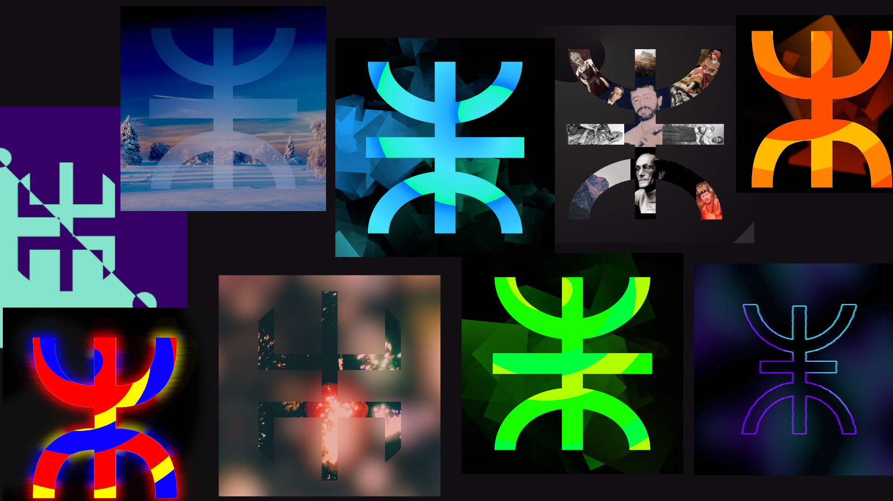

<!-- PROJECT LOGO -->
 

  <h1 align="">berber logo design</h1>

  

    Voici 10 image de la lettre «z» de la célèbre langue Tiffany, et évite le symbole represent le peuple kabyle et berbère .
     
    <a href="https://github.com/assemer/berber-logo-design"><strong>Explore the Images »</strong></a>
     
     
    <a href="">follow Me</a>
  

<!-- TABLE OF CONTENTS -->

  
Images List

  <ol>
    <li><a href="images/ABS(700x700)_1.png">Image 1</a></li>
    <li><a href="images/ABS(700x700)_2.png">Image 2</a></li>
    <li><a href="images/ABS(700x700)_3.png">Image 3</a></li>
    <li><a href="images/ABS(700x700)_4.png">Image 4</a></li>
    <li><a href="images/ABS(700x700)_5.png">Image 5</a></li>
    <li><a href="images/ABS(700x700)_6.png">Image 6</a></li>
    <li><a href="images/ABS(700x700)_7.png">Image 7</a></li>
    <li><a href="images/ABS(700x700)_8.png">Image 8</a></li>
    <li><a href="images/ABS(700x700)_9.png">Image 9</a></li>
    <li><a href="images/ABS(700x700)_10.png">Image 10</a></li>
  </ol>

